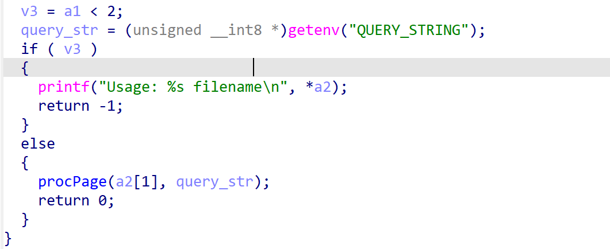
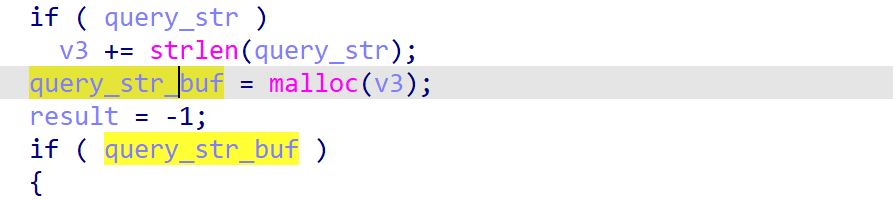
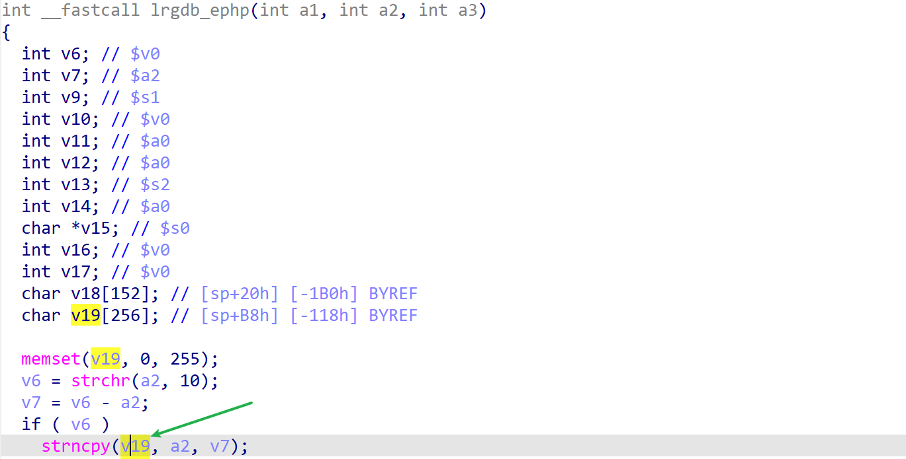

# dap-1522-reva_1.41b02 stack-based buffer overflow vulnerability
## firmware version
vendor: d-link

product: dap-1522-reva

version: below or equal 1.41b02

support url: https://www.dlink.com/rs/sr/products/dap-1522-xtreme-n-duo-wireless-n-access-point#support

firmware download url: https://media.dlink.eu/support/products/dap/dap-1522/driver_software/dap-1522_fw_reva_1-41b02_all_en_20120229.zip

## description
In d-link dap-1522-reva_1.41b02 firmware, binary `/sbin/atp` contains stack-based buffer overflow vulnberability. Attackers can send malicious packet to trigger the vulnerability.

## Impact
The vulnerability can eventually cause Denial Of Service or remote code execution.

## Detail
In `/sbin/atp`, which will handle user's php request, contains such following code. 
1. In `procPage`, which processes user's input

2. query_str is then transfered to `lrgdb_ephp`

3. `lrgdb_ephp` contains a stack-based buffer overflow, because the function didn't check the length of the argument, the stackbuffer(v19)'s size is limited, however, it may copy length over 256 byte's data into v19, causing buffer overflow 
 

## POC
see [poc](./poc)

see [backtrace](./backtrace) for more information.
