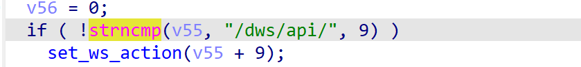
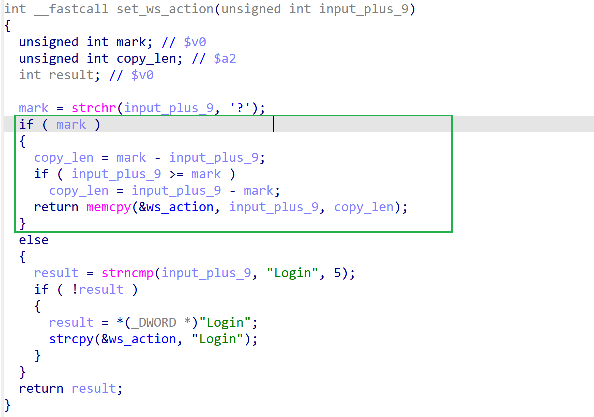
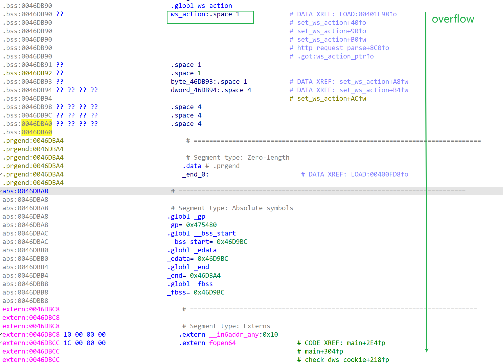

# dap-1620-reva_1.05b05
## firmware version
vendor: d-link

product: dap_1620-reva

version: below or equal 1.05.b05

## description
In d-link dap-1620-reva_1.05b05, binary `/sbin/lighttpd` contains a global variable overflow vulnerability. Attackers can send malicious packet to trigger the vulnerability.

## Impact
The vulnerability can eventually cause Denial Of Service or remote code execution.

## vulnerability
In the `http_request_parse` function of `/sbin/lighttpd`, there exists the following code. If the request contains "/dws/api", the input will be transfered to function `set_ws_action`.

In `set_ws_action`, the following code copied content in the request after '?' into a global variable `ws_action` without checking its length, causing global buffer overflow. 

## POC
see [poc](./poc)

see [backtrace](./backtrace) for more information
