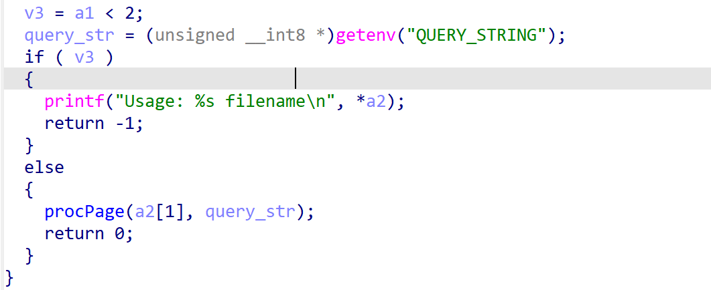
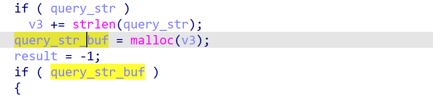
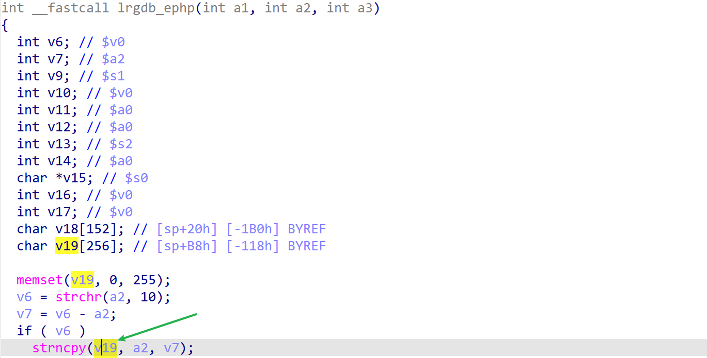

# dap-3520-reva_1.15 buffer overflow
## firmware information
vendor: d-link

product: dap-3520-reva

version: below or equal dap-3520-reva_1.15

## description
In dap-3520-reva_1.15, binary `/sbin/atp` contains stack-based buffer  overflow vulnberability. Attackers can send malicious packet to trigger the vulnerability.

## Impact
The vulnerability can eventually cause Denial Of Service or remote code execution.

## detail 
In `/sbin/atp`, which will handle user's php request, contains such following code. 
1. In `procPage`, which processes user's input

2. query_str is then transfered to `lrgdb_ephp`

3. `lrgdb_ephp` contains a stack-based buffer overflow, because the function didn't check the length of the argument, the stackbuffer(v19)'s size is limited, however, it may copy length over 256 byte's data into v19, causing buffer overflow 

## poc
see [poc](./poc)

see [backtrace](./backtrace) for more information.