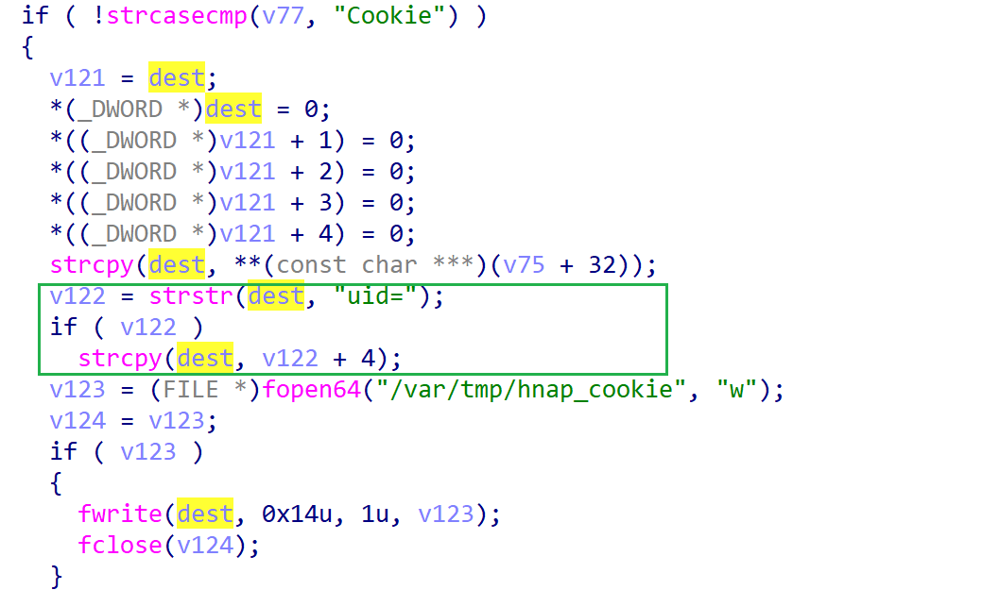

# dsp-w215-reva_114b04 stack-based buffer overflow vulnerability
## firmware infromation
vendor: d-link

product: dsp-w215-reva

version: below or equal 114b04

## description

In dsp-w215-reva, binary `/usr/bin/lighttpd` exists a stack-based buffer overflow vulnerability, attackers can send malicious packet to trigger the vulnerability.

## Impact

The vulnerability can eventually cause Denial Of Service or remote code execution.

## Detail

In the `http_request_parse` function of `lighttpd`, the following code contains stack-based buffer overflow vulnerability.

In address `0x418A3C` ,the following parses http packet's cookie field. If the field `cookie` contains `uid`, a buffer overflow of `dest` will trigger, because the use of `strcpy` didn't check the length of copied data before copying.

## POC
see [poc](./poc)

