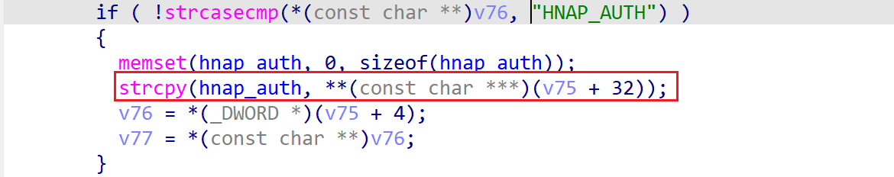

# dsp-w215-reva_114b04 global buffer overflow vulnerability
## firmware infromation
vendor: d-link

product: dsp-w215-reva

version: below or equal 114b04

support url: http://files.dlink.com.au/products/DSP-W215/

firmware download url: http://files.dlink.com.au/products/DSP-W215/REV_A/Firmware/Firmware_v.114B04/DSPW215A1_FW114B04.bin

## description

In dsp-w215-reva, binary `/usr/bin/lighttpd` exists a global buffer overflow vulnerability, attackers can send malicious packet to trigger the vulnerability.

## Impact

The vulnerability can eventually cause Denial Of Service or remote code execution.

## Detail

In the `http_request_parse` function of `lighttpd`, the following code contains stack-based buffer overflow vulnerability.

In address `0x4189FC` ,the following parses http packet's cookie field. If the field `HNAP_AUTH` exists, a buffer overflow of global variable `hnap_auth` will trigger, because the use of `strcpy` didn't check the length of copied data before copying.

Global buffer overflow results in function table overwrite, results in potential denial of service or arbitary code execution.

## POC
see [poc](./poc)
see [backtrace](./backtrace) for more information

