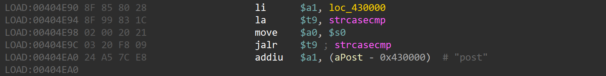

# wnce4004-1.0.0.22 DOS vulnerability
## firmware version
vendor: netgear

product: wnce4004

version: below or equal wnce4004-1.0.0.22

## description
In netgear wnce4004-1.0.0.22, binary `/usr/sbin/uhttpd` contains a DOS vulnerability. Attackers can send malicious packet to trigger the vulnerability.

## detail
In function `handle_request` (address: 0x404988), If the parameter of strcasecmp is NULL, a NULL pointer dereference will happen and causes the web server to stop working.

## send packet
You can send the POC packet via TCP to the `80` port of the firmware's web server to trigger the vulnerability.

## poc
see [poc](./poc)

## screenshot
The qemu logging shows that the web server encounters a crash and SEGSEGV signal has triggered, and web server has stoppod working.

