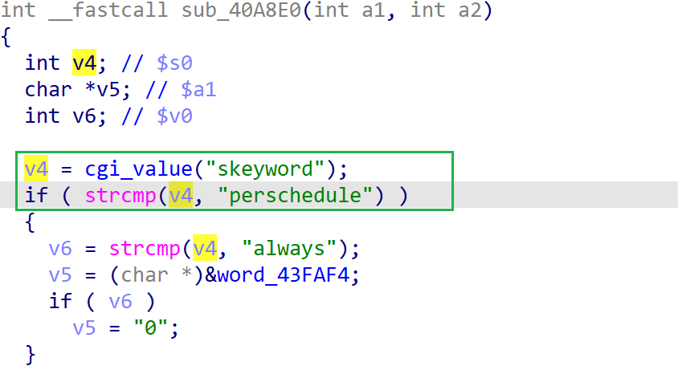

# wnce4004-1.0.0.22 DOS vulnerability
## firmware version
vendor: netgear

product: wnce4004

version: below or equal wnce4004-1.0.0.22

support url: https://www.netgear.com/support/product/wnce4004/#download

firmware download url: https://www.downloads.netgear.com/files/GDC/WNCE4004/WNCE4004_V1.0.0.22.zip

## description
In netgear wnce4004-1.0.0.22, binary `/usr/sbin/uhttpd` contains a DOS vulnerability. Attackers can send malicious packet to trigger the vulnerability. The vulnerability lies in the dereference of parameter `skeyword` in `sub_40A8E0`

## Impact
The vulnerability can cause Denial Of Service of the device.

## detail
In the address 0x41025C of `/usr/sbin/uhttpd`, the following  parses user's input containing `skeyword` into `v4`.

However, it didn't check whether the parameter `v4` is NULL or not before using it as a parameter of `strcmp` , causing potential NULL pointer dereference.

## POC
see [poc](./poc)

see [backtrace](./backtrace) for more information

