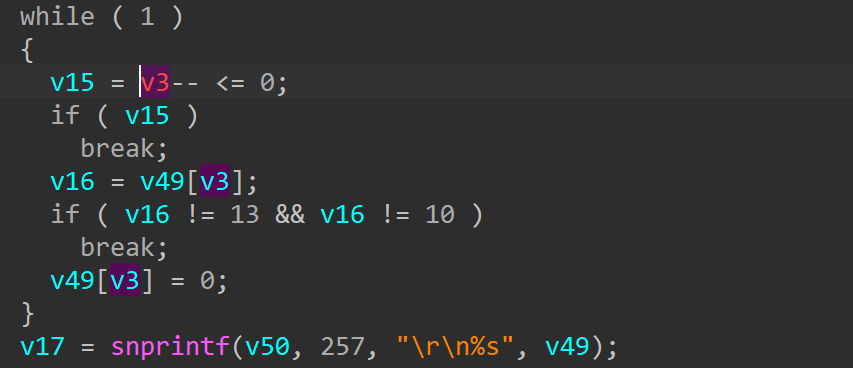
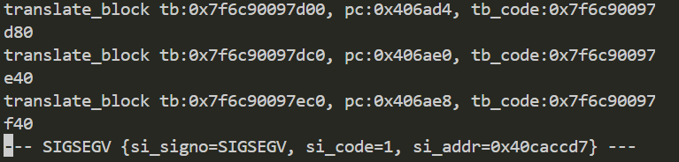

# wnce4004-1.0.0.22 buffer overflow vulnerability
## firmware version
vendor: netgear

product: wnce4004

version: below or equal wnce4004-1.0.0.22

support url: https://www.netgear.com/support/product/wnce4004/#download

firmware download url: https://www.downloads.netgear.com/files/GDC/WNCE4004/WNCE4004_V1.0.0.22.zip

## description
In netgear wnce4004-1.0.0.22, binary `/usr/sbin/uhttpd` contains a buffer overflow vulnerability. Attackers can send malicious packet to trigger the vulnerability.

## detail
In function `get_postfile` (address: 0x406974), there exists a buffer overflow vulnerability. 

## send packet
You can send the POC packet via TCP to the `80` port of the firmware's web server to trigger the vulnerability.

## poc
see [poc](./poc)

## screenshot
The qemu logging shows that the web server encounters a crash and SEGSEGV signal has triggered, and web server has stopped working. The si_addr indicates that address being accessed is mis-aligned due to stack buffer has been overwritten by user input.

## timeline
[24/10/11] report to vendor and CVE
