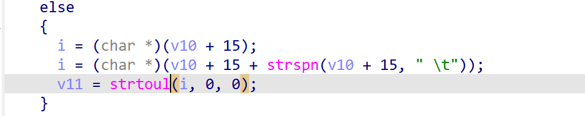

# wnce4004-1.0.0.22 DOS vulnerability
## firmware version
vendor: netgear

product: wnce4004

version: below or equal wnce4004-1.0.0.22

## description
In netgear wnce4004-1.0.0.22, binary `/usr/sbin/uhttpd` contains a DOS vulnerability. Attackers can send malicious packet to trigger the vulnerability. The vulnerability lies in `strtoul` in function `handle_request`

## Impact
The vulnerability can cause Denial Of Service of the device.

## detail
In the address 0x404C2C of `/usr/sbin/uhttpd`, the following code parses user's input field `Content-Length`

However, if the field of Content-Length has no data, the `strtoul` will encounter NULL Pointer Dereference vulnerability, eventually cause Denial Of Service.

## POC
see [poc](./poc)

