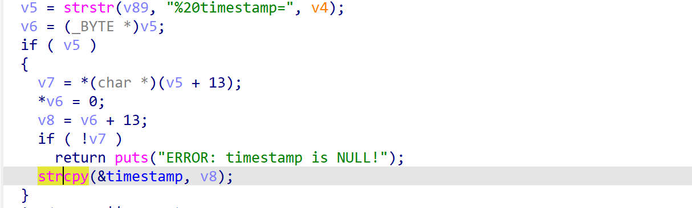

# wnce4004-1.0.0.22 global buffer overflow vulnerability
## firmware version
vendor: netgear

product: wnce4004

version: below or equal wnce4004-1.0.0.22

support url: https://www.netgear.com/support/product/wnce4004/#download

firmware download url: https://www.downloads.netgear.com/files/GDC/WNCE4004/WNCE4004_V1.0.0.22.zip

## description
In netgear wnce4004-1.0.0.22, binary `/usr/sbin/uhttpd` contains a Global buffer overflow vulnerability. Attackers can send malicious packet to trigger the vulnerability.

## Impact
The vulnerability can cause Denial Of Service of the device or arbitary code execution.

## Detail
In function `handle_request`, the following code parses user input with field name `timestamp`

However, it didn't check the length of `timestamp` before copying it to global buffer `timestamp`(addr: 0x4AD670). The global buffer overflow can overwrite function pointer, causing Denial of Service or arbitary code execution.

## POC
see [poc](./poc)
