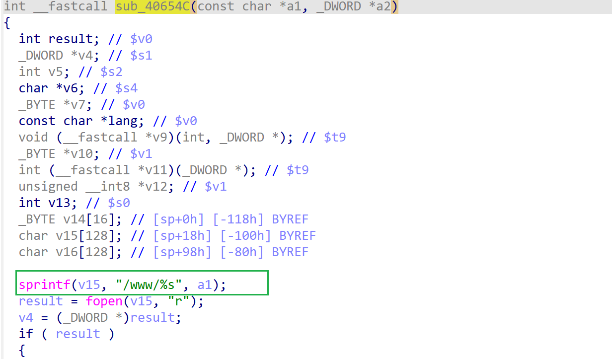

# wnce4004-1.0.0.22 stack-based buffer overflow vulnerability
## firmware information
vendor: netgear

product: wnce4004

version: below or equal wnce4004-1.0.0.22

## description
In netgear wnce4004-1.0.0.22, binary `/usr/sbin/uhttpd` contains a stack-based buffer overflow vulnerability at address 0x40654C. Attackers can send malicious packet to trigger the vulnerability.'

## Impact
The vulnerability can cause Denial Of Service of the device or arbitary code execution.

## Detail
In function `sub_40654C`(address: 0x40654C), it concated user's input into local stack buffer, without checking its length. This results in stack-based buffer overflow

## POC
see [poc](./poc)

You can refer to qemu [backtrace](./backtrace) for further information.
