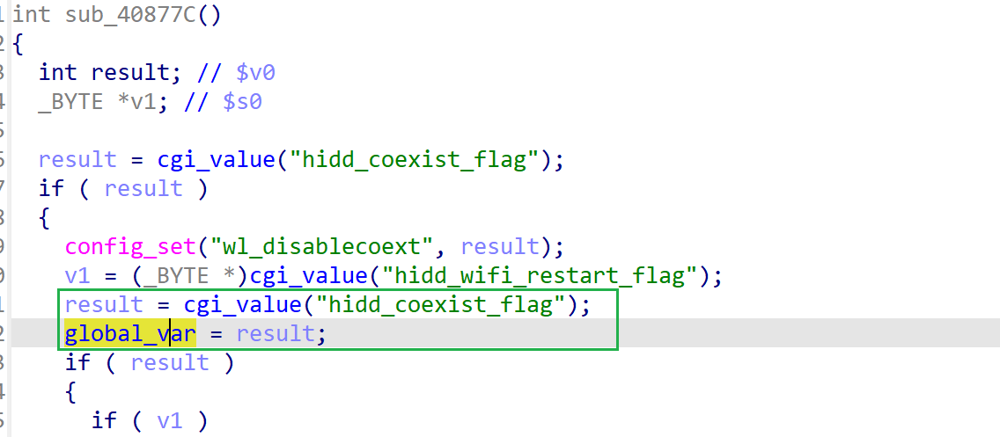

# wnce4004-1.0.0.22 DOS vulnerability
## firmware version
vendor: netgear

product: wnce4004

version: below or equal wnce4004-1.0.0.22

## description
In netgear wnce4004-1.0.0.22, binary `/usr/sbin/uhttpd` contains a DOS vulnerability. Attackers can send malicious packet to trigger the vulnerability. The vulnerability lies in the dereference of parameter in `cmd_wifi_coexist`

## Impact
The vulnerability can cause Denial Of Service of the device.

## detail
In the address 0x41EE78 of `/usr/sbin/uhttpd`, the following code parses user's input in of `hidd_coexist_flag` into global_var (at address 0x408814). The result of cgi_request() may be NULL if parameter is not presented in user's input.

The global_var is then used in `cgi_commit` to invoke cgi requests.

However, in function  `cmd_wifi_coexist`, the following code didn't check whether the argument(which is `global_var`) before dereference it. It may cause NULL pointer dereference and Denial Of Service.

## POC
see [poc](./poc)

see [backtrace](./backtrace) for more information

