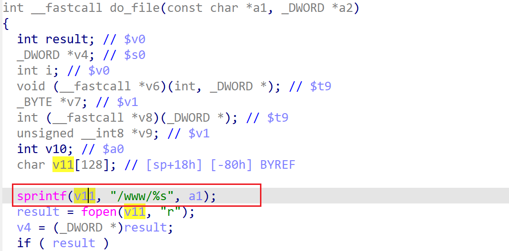

# wndr3700v2-1.0.0.8 stack-based buffer overflow vulnerability
## firmware version
vendor: netgear

product: wndr3700v2

version: below or equal wndr3700v2-1.0.0.8

support url: https://www.netgear.com/support/product/wndr3700v2/#download

firmware download url: https://www.downloads.netgear.com/files/GDC/WNDR3700V2/WNDR3700v2%20WNDR37AVv2%20Firmware%20Version%201.0.0.8.zip

## description
In netgear wndr3700v2-1.0.0.8, binary `/usr/sbin/uhttpd` contains a stack-based buffer overflow vulnerability. Attackers can send malicious packet to trigger the vulnerability. The problem lies in function `do_file`.

## Impact
The vulnerability can cause Denial Of Service of the device, or even arbitary code execution.

## detail
In function `do_file` (address: 0x4051DC), the following code concats user's input into local variable `v11`, which is a stack-based variable with limited size.

However, it didn't check the length of input from user, Causing potential stack-based buffer overflow. 

## poc
see [poc](./poc)

