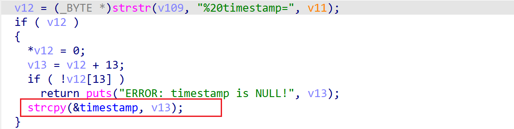

# wndr3700v2-1.0.0.8 global variable buffer overflow vulnerability
## firmware version
vendor: netgear

product: wndr3700v2

version: below or equal wndr3700v2-1.0.0.8

support url: https://www.netgear.com/support/product/wndr3700v2/#download

firmware download url: https://www.downloads.netgear.com/files/GDC/WNDR3700V2/WNDR3700v2%20WNDR37AVv2%20Firmware%20Version%201.0.0.8.zip

## description
In netgear wndr3700v2-1.0.0.8, binary `/usr/sbin/uhttpd` contains a global variable buffer overflow vulnerability. Attackers can send malicious packet to trigger the vulnerability. The problem lies in parsing global variable `timnestamp` in `handle_request`.

## Impact
The vulnerability can cause Denial Of Service of the device, or even arbitary code execution.

## detail
In function `handle_request` (address: 0x4071B8), the following code copies user's input into global variable `timestamp`, which is a global variable with limited size.

However, it didn't check the length of input from user, Causing potential global variable buffer overflow. The overflow can overwrite function table, causing potential arbitary code execution.

## poc
see [poc](./poc)

see [backtrace](./backtrace) for more information.

