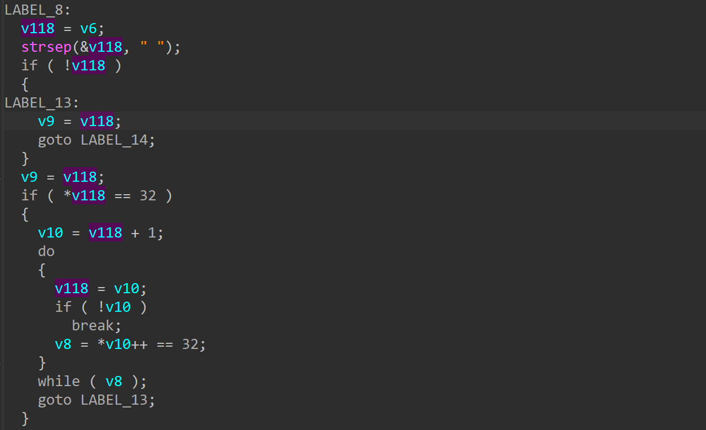
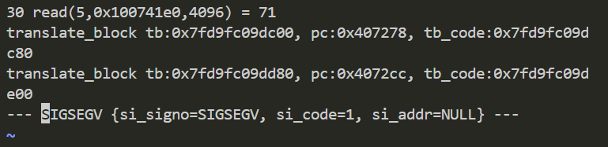

# wndr37avv2-1.0.0.10 DoS vulnerability
## firmware version
vendor: netgear

product: wndr37avv2

version: below or equal wndr37avv2-1.0.0.10

## description
In netgear wndr37avv2-1.0.0.10, binary `/usr/sbin/uhttpd` contains a NULL pointer dereference. Attackers can send malicious packet to trigger the vulnerability, causing DOS on this firmware.

## detail
In function `handle_request` (address: 0x4071B8), the following code contains NULL pointer dereference vulnerability.

## send packet
You can send the POC packet via TCP to the `80` port of the firmware's web server to trigger the vulnerability.

## poc
see [poc](./poc)

## screenshot
The qemu logging shows that the web server encounters a crash and SEGSEGV signal has triggered, and web server has stoppod working.From the logging information, a NULL pointer dereference and DoS on firmware can be observed.

