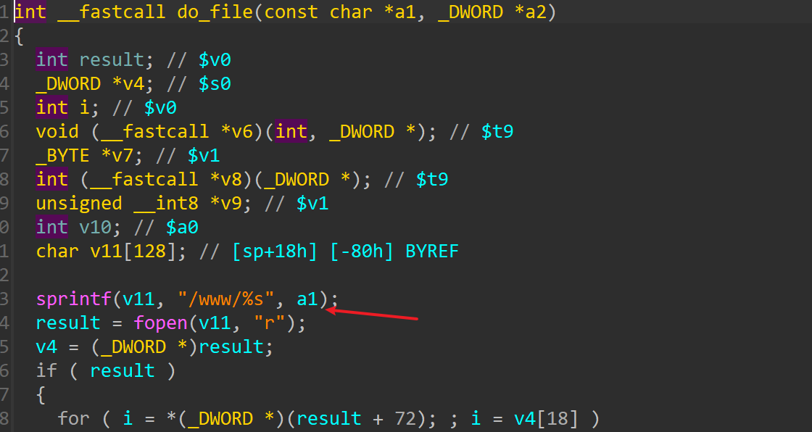
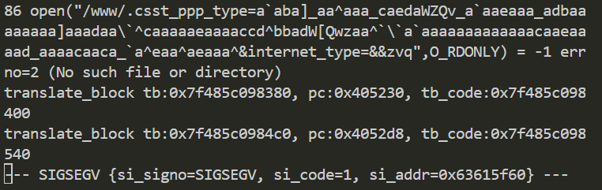

# wndr37avv2-1.0.0.10 stack-based buffer overflow vulnerability
## firmware version
vendor: netgear

product: wndr37avv2

version: below or equal wndr37avv2-1.0.0.10

## description
In netgear wndr37avv2-1.0.0.10, binary `/usr/sbin/uhttpd` contains a stack-based buffer overflow. Attackers can send malicious packet to trigger the vulnerability, causing DOS or execute arbitary code on this firmware.

## detail
In function `do_file` (address: 0x4051DC), the following code contains stack-based buffer overflow vulnerability.

## send packet
You can send the POC packet via TCP to the `80` port of the firmware's web server to trigger the vulnerability.

## poc
see [poc](./poc)

## screenshot
The qemu logging shows that the web server encounters a crash and SEGSEGV signal has triggered, and web server has stoppod working.From the logging information, a stack-based buffer overflow can be observed(the `si_addr=0x63615f60` contains user input)

## timeline
[24/10/11] report to vendor and CVE
