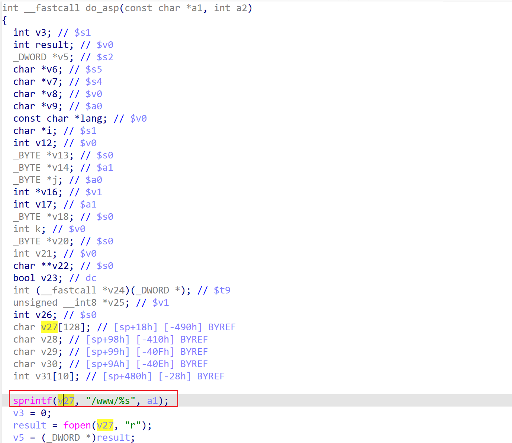

# wndr37avv2-1.0.0.10 stack-based buffer overflow vulnerability
## firmware version
vendor: netgear

product: wndr37avv2

version: below or equal wndr37avv2-1.0.0.10

## description
In netgear wndr37avv2-1.0.0.10, binary `/usr/sbin/uhttpd` contains a stack-based buffer overflow vulnerability. Attackers can send malicious packet to trigger the vulnerability. The problem lies in function `do_asp`.

## Impact
The vulnerability can cause Denial Of Service of the device, or even arbitary code execution.

## detail
In function `do_asp` (address: 0x421FCC), the following code concats user's input into local variable `v27`, which is a stack-based variable with limited size.

However, it didn't check the length of input from user, Causing potential stack-based buffer overflow. 

## poc
see [poc](./poc)

see [backtrace](./backtrace) for more information.

