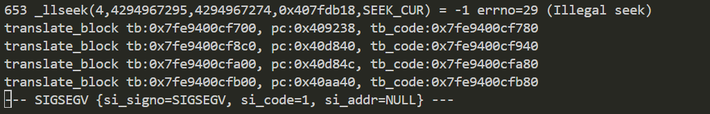

# wndrmac-1.0.0.10 DOS vulnerability
## firmware version
vendor: netgear

product: wndrmac

version: below or equal wndrmac-1.0.0.10

support url: https://www.netgear.com/support/product/wndrmacv2/#download

firmware download url: https://www.downloads.netgear.com/files/WNDRMACv2/WNDRMACv2%20Firmware%20Version%201.0.0.10.zip

## description
In netgear wndrmac-1.0.0.10, binary `/usr/sbin/uhttpd` contains a DOS vulnerability. Attackers can send malicious packet to trigger the vulnerability.

## detail
In function `do_apply` (address: 0x40AA40), malicious TCP packet will trigger NULL pointer dereference and cause DoS.

The root cause of the vulnerability is that the code didn't check whether the parameter `v3` is NULL before using it as parameter of `strstr`

## send packet
You can send the POC packet via TCP to the `80` port of the firmware's web server to trigger the vulnerability.

## poc
see [poc](./poc)

## screenshot
The qemu logging shows that the web server encounters a crash and SEGSEGV signal has triggered, and web server has stoppod working.

## timeline
[24/10/11] report to vendor and CVE
