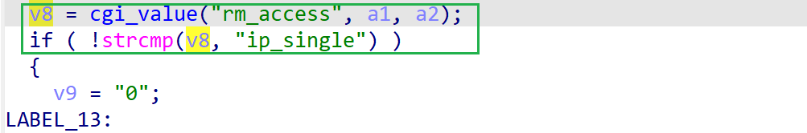

# wndrmac-1.0.0.10 DOS vulnerability
## firmware version
vendor: netgear

product: wndrmac

version: below or equal wndrmac-1.0.0.10

## description
In netgear wndrmac-1.0.0.10, binary `/usr/sbin/uhttpd` contains a DOS vulnerability. Attackers can send malicious packet to trigger the vulnerability. The vulnerability lies in the dereference of parameter `rm_access` in `config_remote`

## Impact
The vulnerability can cause Denial Of Service of the device.

## detail
In function `config_remote` (address: 0x4410DC) of `/usr/sbin/uhttpd`, the following  parses user's input containing `rm_access` into `v8`

However, it didn't check whether the parameter `v8` is NULL or not before used as a parameter of strcmp, causing potential NULL pointer dereference.

