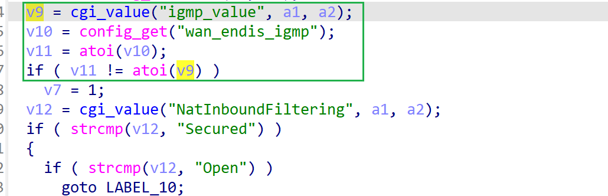

# wndrmac-1.0.0.10 DOS vulnerability
## firmware version
vendor: netgear

product: wndrmac

version: below or equal wndrmac-1.0.0.10

## description
In netgear wndrmac-1.0.0.10, binary `/usr/sbin/uhttpd` contains a DOS vulnerability. Attackers can send malicious packet to trigger the vulnerability. The vulnerability lies in the dereference of parameter `igmp_value` in `config_wan`

## Impact
The vulnerability can cause Denial Of Service of the device.

## detail
In function `config_wan` (address: 0x437E40) of `/usr/sbin/uhttpd`, the following  parses user's input containing `igmp_value` into `v9`

However, it didn't check whether the parameter `v9` is NULL or not before used as a parameter of `atoi`, causing potential NULL pointer dereference.

## POC
see [poc](./poc) 

see [backtrace](./backtrace) for further information

