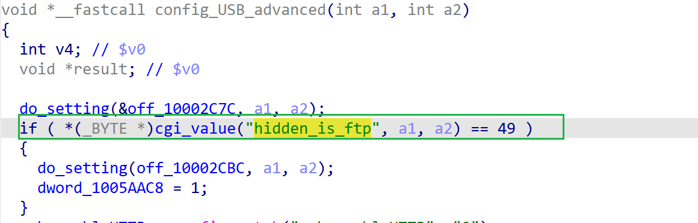

# wndrmac-1.0.0.10 DOS vulnerability
## firmware version
vendor: netgear

product: wndrmac

version: below or equal wndrmac-1.0.0.10

## description
In netgear wndrmac-1.0.0.10, binary `/usr/sbin/uhttpd` contains a DOS vulnerability. Attackers can send malicious packet to trigger the vulnerability. The vulnerability lies in the dereference of parameter `hidden_is_ftp` in `config_USB_advanced`

## Impact
The vulnerability can cause Denial Of Service of the device.

## detail
In function `config_USB_advanced` (address: 0x43E088) of `/usr/sbin/uhttpd`, the following parses user's input containing `hidden_is_ftp`.

However, it didn't check whether the result of `cgi_value` is NULL or not before dereference it, causing potential NULL pointer dereference.

## POC
see [poc](./poc) 

see [backtrace](./backtrace) for further information

