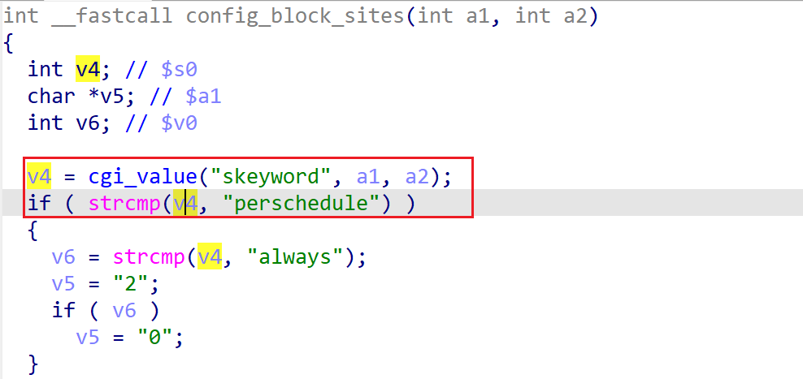

# wndrmac-1.0.0.10 DOS vulnerability
## firmware version
vendor: netgear

product: wndrmac

version: below or equal wndrmac-1.0.0.10

support url: https://www.netgear.com/support/product/wndrmacv2/#download

firmware download url: https://www.downloads.netgear.com/files/WNDRMACv2/WNDRMACv2%20Firmware%20Version%201.0.0.10.zip

## description
In netgear wndrmac-1.0.0.10, binary `/usr/sbin/uhttpd` contains a DOS vulnerability. Attackers can send malicious packet to trigger the vulnerability. The vulnerability lies in the dereference of parameter `skeyword` in `config_block_sites`

## Impact
The vulnerability can cause Denial Of Service of the device.

## detail
In function `config_block_sites` (address: 0x43F000) of `/usr/sbin/uhttpd`, the following parses user's input containing `skeyword` into parameter `v4`.

However, it didn't check whether value `v4` is NULL or not before using it as an argument of `strcmp`, causing potential NULL pointer dereference.

## POC
see [poc](./poc) 

see [backtrace](./backtrace) for further information

