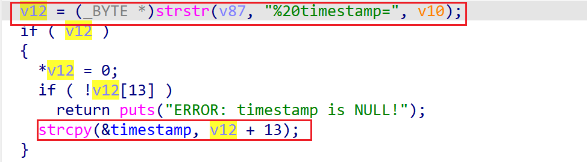

# wndrmac-1.0.0.10 global variable buffer overflow vulnerability
## firmware version
vendor: netgear

product: wndrmac

version: below or equal wndrmac-1.0.0.10

support url: https://www.netgear.com/support/product/wndrmacv2/#download

firmware download url: https://www.downloads.netgear.com/files/WNDRMACv2/WNDRMACv2%20Firmware%20Version%201.0.0.10.zip

## description
In netgear wndrmac-1.0.0.10, binary `/usr/sbin/uhttpd` contains a global variable buffer overflow vulnerability. Attackers can send malicious packet to trigger the vulnerability. The vulnerability lies in the dereference of parameter `timestamp` in `handle_request`

## Impact
The vulnerability can cause Denial Of Service of the device or even arbitary code execution.

## detail
In function `handle_request` (address: 0x40C168) of `/usr/sbin/uhttpd`, the following parses user's input containing `timestamp` into parameter `v12`.

However, it didn't check the data length of parameter `v12` before using `strcpy` to copy it into global variable, causing potential global variable buffer overflow.

The overflow can result in overwriting function pointer, resulting in code execution.
## POC
see [poc](./poc) 

see [backtrace](./backtrace) for further information

