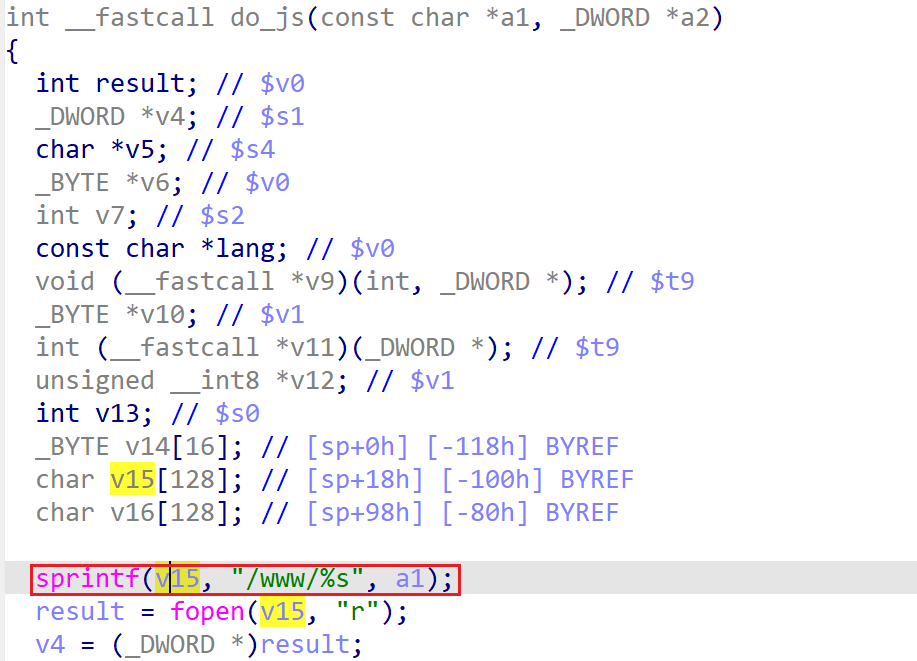

# wndrmac-1.0.0.10 stack-based buffer overflow vulnerability
## firmware version
vendor: netgear

product: wndrmac

version: below or equal wndrmac-1.0.0.10

support url: https://www.netgear.com/support/product/wndrmacv2/#download

firmware download url: https://www.downloads.netgear.com/files/WNDRMACv2/WNDRMACv2%20Firmware%20Version%201.0.0.10.zip

## description
In netgear wndrmac-1.0.0.10, binary `/usr/sbin/uhttpd` contains a stack-based buffer overflow vulnerability. Attackers can send malicious packet to trigger the vulnerability. The vulnerability lies in function `do_js`.

## Impact
The vulnerability can cause Denial Of Service of the device or even arbitary code execution.

## detail
In function `do_js` (address: 0x409640) of `/usr/sbin/uhttpd`, the following code concats user's input into a stack-based buffer `v15` with fixed length.

However, the code didn't check the length of user input before concating it. It may cause potential stack-based buffer overflow.

## POC
see [poc](./poc) 

see [backtrace](./backtrace) for further information

