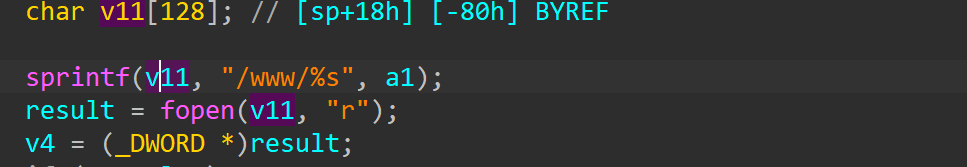
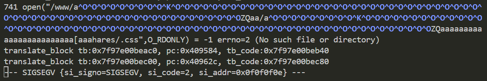

# wndrmac-1.0.0.10 stack-based buffer overflow vulnerability
## firmware version
vendor: netgear

product: wndrmac

version: below or equal wndrmac-1.0.0.10

## description
In netgear wndrmac-1.0.0.10, binary `/usr/sbin/uhttpd` contains a stack-based buffer overflow vulnerability. Attackers can send malicious packet to trigger the vulnerability, causing DoS or arbitary command execution.

## detail
In function `do_file` (address: 0x409530), malicious TCP packet will trigger stack-based buffer overflow. The reason is that value `v11` will be overflowed bu `sprintf` if `a1` is longer than 0x80 bytes, which is controlled by attacker.

## send packet
You can send the POC packet via TCP to the `80` port of the firmware's web server to trigger the vulnerability.

## poc
see [poc](./poc)

## screenshot
The qemu logging shows that the web server encounters a crash and SEGSEGV signal has triggered, and web server has stoppod working. The pc is overwitten by value `0x0f0f0f0e`, which is contained in POC. This indicates that a stack-based overflow has triggered.

## timeline
[24/10/11] report to vendor and CVE
