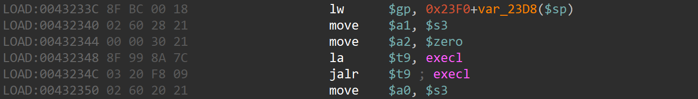
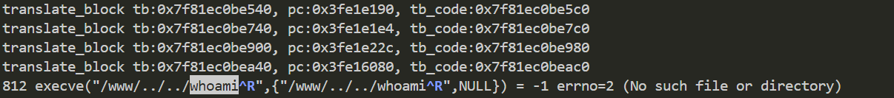

# wndrmac-1.0.0.10 command injection vulnerability
## firmware version
vendor: netgear

product: wndrmac

version: below or equal wndrmac-1.0.0.10

## description
In netgear wndrmac-1.0.0.10, binary `/usr/sbin/uhttpd` contains a command injection vulnerability. Attackers can send malicious packet to trigger the vulnerability.

## detail
In function `cgi_request` (address: 0x431C4C), contains a command injection vulnerability. Attackers can send malicious packet to cau se command injection and execute arbitary command.

## send packet
You can send the POC packet via TCP to the `80` port of the firmware's web server to trigger the vulnerability.

## poc
see [poc](./poc)

## screenshot
The qemu logging shows that the web server is launching a new program which is contained in our poc, meaning thet arbitary command can be executed(with path traversal).

