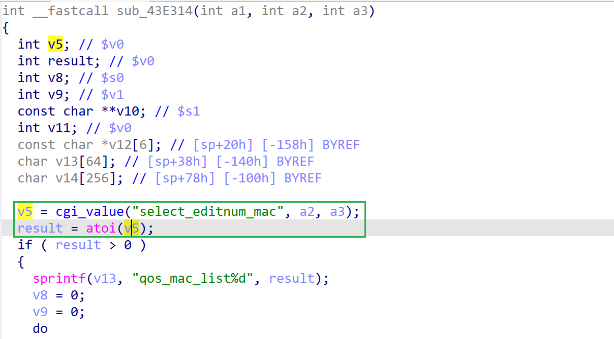

# wndrmac-1.0.0.10 DOS vulnerability
## firmware version
vendor: netgear

product: wndrmac

version: below or equal wndrmac-1.0.0.10

support url: https://www.netgear.com/support/product/wndrmacv2/#download

firmware download url: https://www.downloads.netgear.com/files/WNDRMACv2/WNDRMACv2%20Firmware%20Version%201.0.0.10.zip

## description
In netgear wndrmac-1.0.0.10, binary `/usr/sbin/uhttpd` contains a DOS vulnerability. Attackers can send malicious packet to trigger the vulnerability. The vulnerability lies in the dereference of parameter `select_editnum_mac` in `sub_43E314`

## Impact
The vulnerability can cause Denial Of Service of the device.

## detail
In the address 0x43E358 of `/usr/sbin/uhttpd`, the following  parses user's input containing `select_editnum_mac` into `v5`. Then `v5` is used as a parameter of `atoi`.

However, it didn't check whether the parameter `v5` is NULL or not before dereference, causing potential NULL pointer dereference.

## How to trigger
You can send the POC packet via TCP to the `80` port of the firmware's web server to trigger the vulnerability.

## poc
see [poc](./poc)

see [backtrace](./backtrace) for more information
