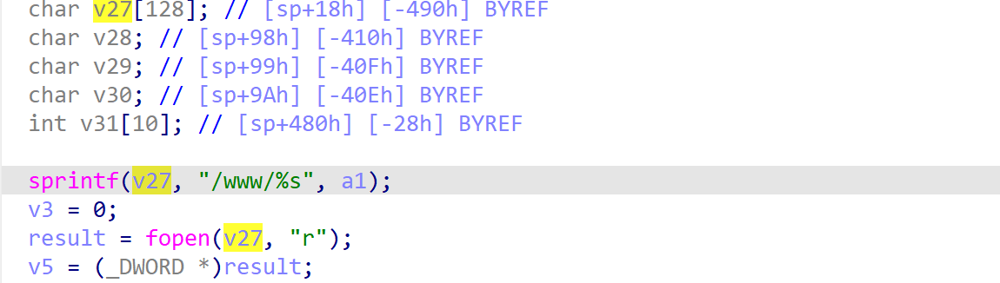

# wndrmac-1.0.0.10 DOS vulnerability
## firmware version
vendor: netgear

product: wndrmac

version: below or equal wndrmac-1.0.0.10

## description
In netgear wndrmac-1.0.0.10, binary `/usr/sbin/uhttpd` contains a stack-based buffer overflow vulnerability. Attackers can send malicious packet to trigger the vulnerability. The vulnerability lies in the function `do_asp`

## Impact
The vulnerability can cause Denial Of Service of the device or arbitary code execution.

## detail
In the function `do_asp`(addres: 0x413928) of `/usr/sbin/uhttpd`, the following code uses `sprintf` ro concate user's input into a local stack-based buffer without checking its length.

This will result in stack-based buffer overflow. Attacker can provide a very long string contains ".htm" in URI field to trigger the vulnerability.

## POC
see [poc](./poc)

see [backtrace](./backtrace) for more information

