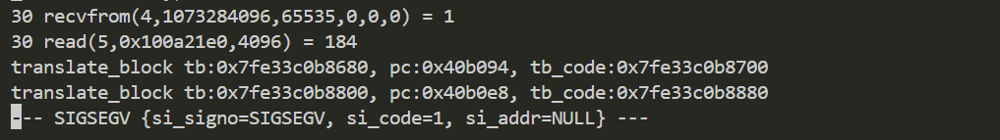

# wndrmacv1-1.0.0.20 DOS vulnerability
## firmware version
vendor: netgear

product: wndrmacv1

version: below or equal wndrmacv1-1.0.0.20

## description
In netgear wndrmacv1-1.0.0.20, binary `/usr/sbin/uhttpd` contains a DOS vulnerability. Attackers can send malicious packet to trigger the vulnerability.

## detail
In function `handle_request` (address: 0x40AFD4), malicious TCP packet will trigger NULL pointer dereference and cause DoS.

## send packet
You can send the POC packet via TCP to the `80` port of the firmware's web server to trigger the vulnerability.

## poc
see [poc](./poc)

## screenshot
The qemu logging shows that the web server encounters a crash and SEGSEGV signal has triggered, and web server has stoppod working.

## timeline
[24/10/11] report to vendor and CVE