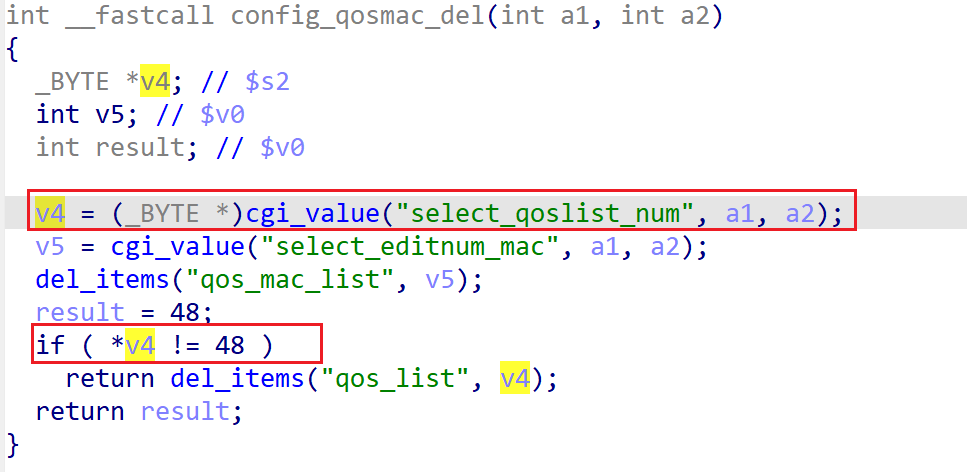

# wndrmacv1-1.0.0.20 DOS vulnerability
## firmware version
vendor: netgear

product: wndrmacv1

version: below or equal wndrmacv1-1.0.0.20

## description
In netgear wndrmacv1-1.0.0.20, binary `/usr/sbin/uhttpd` contains a DOS vulnerability. Attackers can send malicious packet to trigger the vulnerability. The vulnerability lies the dereference of parameter `select_qoslist_num` in `config_qosmac_del`(address: 0x439A2C)

## Impact
The vulnerability can cause Denial Of Service of the device.

## detail
In function `config_qosmac_del` (address: 0x439A2C), the following code parses user's input containing `select_qoslist_num` into `v4`. Then `v4` is dereferenced without checking whether it's NULL or not, causing potential NULL pointer dereference.

## poc
see [poc](./poc)

see [backtrace](./backtrace) for more information.