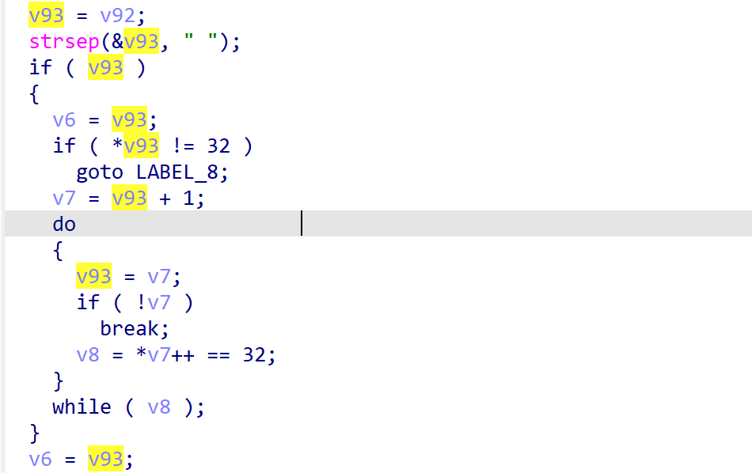
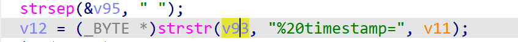

# wndrmacv1-1.0.0.20 DOS vulnerability
## firmware version
vendor: netgear

product: wndrmacv1

version: below or equal wndrmacv1-1.0.0.20

support url: https://www.netgear.com/support/product/wndrmacv1/#download

firmware download url: https://www.downloads.netgear.com/files/GDC/WNDRMACv1/WNDRMAC%20Firmware%20Version%201.0.0.20.zip

## description
In netgear wndrmacv1-1.0.0.20, binary `/usr/sbin/uhttpd` contains a DOS vulnerability. Attackers can send malicious packet to trigger the vulnerability. The vulnerability lies the use of `strstr` in `handle_request` without checking its argument is NULL or not.

## Impact
The vulnerability can cause Denial Of Service of the device.

## detail
In function `handle_request` (address: 0x40AFD4), the following code parses user's input containing `%20timestamp=`. However, if user's input doesn't contain blank space, a potential NULL pointer dereference will trigger. The following code shows how web server parses user's input.

The problem lies in the following `strstr`.Parameter `v93` may be NULL, which will cause NULL pointer dereference.

## poc
see [poc](./poc)

see [backtrace](./backtrace) for more information.