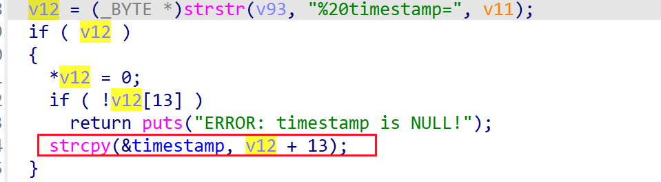

# wndrmacv1-1.0.0.20 global variable buffer overflow vulnerability
## firmware version
vendor: netgear

product: wndrmacv1

version: below or equal wndrmacv1-1.0.0.20

support url: https://www.netgear.com/support/product/wndrmacv1/#download

firmware download url: https://www.downloads.netgear.com/files/GDC/WNDRMACv1/WNDRMAC%20Firmware%20Version%201.0.0.20.zip

## description
In netgear wndrmacv1-1.0.0.20, binary `/usr/sbin/uhttpd` contains a global variable buffer overflow vulnerability. Attackers can send malicious packet to trigger the vulnerability. The vulnerability lies the dereference of parameter `rm_access` in `handle_request`(address: 0x40AFD4)

## Impact
The vulnerability can cause Denial Of Service of the device, or even arbitary code execution.

## detail
In function `handle_request` (address: 0x40AFD4), the following code parses user's input containing `%20timestamp=` into `v12`. Then `v12` concated using `strcpy` into global buffer `timestamp` without checking whether it's length, causing potential global variable buffer overflow

This can cause overflow and rewriting function table in this binary, causing arbitary code execution.

## poc
see [poc](./poc)

see [backtrace](./backtrace) for more information.