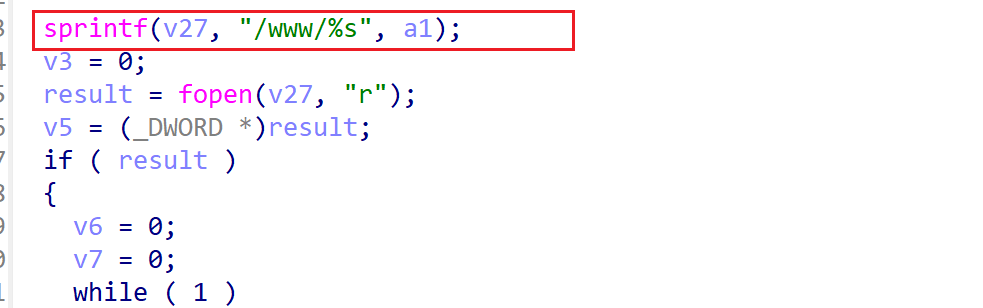

# wndrmacv1-1.0.0.20 stack-based buffer overflow vulnerability
## firmware version
vendor: netgear

product: wndrmacv1

version: below or equal wndrmacv1-1.0.0.20

## description
In netgear wndrmacv1-1.0.0.20, binary `/usr/sbin/uhttpd` contains a stack-based buffer overflow vulnerability. Attackers can send malicious packet to trigger the vulnerability. The vulnerability lies the function `do_asp`.

## Impact
The vulnerability can cause Denial Of Service of the device, or even arbitary code execution.

## detail
In function `do_asp` (address: 0x4119D8), the following code concated user's input into a stack-based buffer without checking its length, causing potential stack-based buffer overflow.

## poc
see [poc](./poc)
