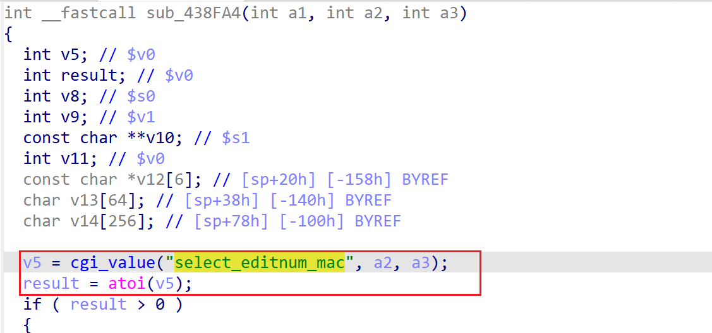

# wndrmacv1-1.0.0.20 DOS vulnerability
## firmware version
vendor: netgear

product: wndrmacv1

version: below or equal wndrmacv1-1.0.0.20

support url: https://www.netgear.com/support/product/wndrmacv1/#download

firmware download url: https://www.downloads.netgear.com/files/GDC/WNDRMACv1/WNDRMAC%20Firmware%20Version%201.0.0.20.zip

## description
In netgear wndrmacv1-1.0.0.20, binary `/usr/sbin/uhttpd` contains a DOS vulnerability. Attackers can send malicious packet to trigger the vulnerability. The vulnerability lies the dereference of parameter `select_editnum_mac` in `sub_438FA4`(address: 0x438FA4)

## Impact
The vulnerability can cause Denial Of Service of the device.

## detail
In function `sub_438FA4` (address: 0x438FA4), the following code parses user's input containing `select_editnum_mac` into `v5`. Then `v5` is used as a parameter of `atoi` without checking whether it's NULL or not, causing potential NULL pointer dereference.

## poc
see [poc](./poc)

see [backtrace](./backtrace) for more information.