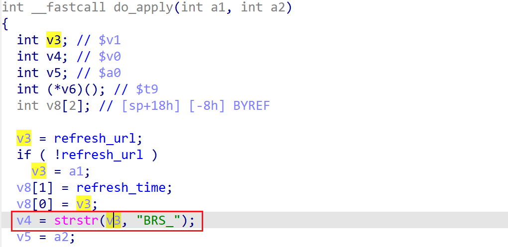

# wndrmacv1-1.0.0.20 DOS vulnerability
## firmware version
vendor: netgear

product: wndrmacv1

version: below or equal wndrmacv1-1.0.0.20

## description
In netgear wndrmacv1-1.0.0.20, binary `/usr/sbin/uhttpd` contains a DOS vulnerability. Attackers can send malicious packet to trigger the vulnerability. The vulnerability lies the NULL pointer dereference when using `strcmp` in function `do_apply`(address: 0x409CFC)

## Impact
The vulnerability can cause Denial Of Service of the device.

## detail
In function `do_apply` (address: 0x409CFC), the following code parses user's input and `v3` is part of user's input. Then `v3` is used as a parameter of `strstr` without checking whether it's NULL or not, causing potential NULL pointer dereference.

## poc
see [poc](./poc)

see [backtrace](./backtrace) for more information.