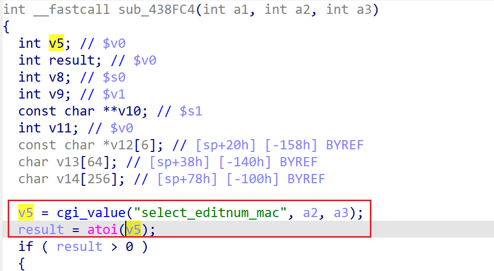

# wndrmacv2-1.0.0.4 DoS vulnerability
## firmware version
vendor: netgear

product: wndrmacv2

version: below or equal wndrmacv2-1.0.0.4

## description
In netgear wndrmacv2-1.0.0.4, binary `/usr/sbin/uhttpd` contains a NULL pointer dereference vulnerability in `sub_438FC4`. Attackers can send malicious packet to trigger the vulnerability.

## Impact
Attackers can send malicious packet to trigger the vulnerability, causing Denial Of Service.

## detail
In function `sub_438FC4` (address: 0x438FC4), the following code parses user's input containing `select_editnum_mac` into `v5`. Then `v5` is used and dereferenced in `atoi` without checking it's NULL or not, causing potential NULL pointer dereference.

## poc
see [poc](./poc)

see [backtrace](./backtrace) for more information.
