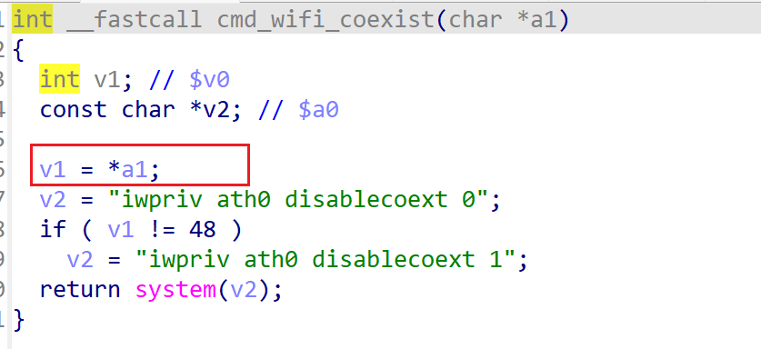

# wndrmacv2-1.0.0.4 DoS vulnerability
## firmware version
vendor: netgear

product: wndrmacv2

version: below or equal wndrmacv2-1.0.0.4

## description
In netgear wndrmacv2-1.0.0.4, binary `/usr/sbin/uhttpd` contains a NULL pointer dereference vulnerability in `cmd_wifi_coexist`. Attackers can send malicious packet to trigger the vulnerability.

## Impact
Attackers can send malicious packet to trigger the vulnerability, causing Denial Of Service.

## detail
In function `sub_40DD64` (address: 0x40DD64), the following code parses user's input containing `hidd_coexist_flag` into global variable `dword_1000D080`.

Then global variable `dword_1000D080` is used in `cgi_commit` as a parameter of `cmd_wifi_coexist`

In `cmd_wifi_coexist`, the following code uses and dereferenced its irst parameter without checking whether the argument is NULL or not, causing potential NULL pointer dereference.

## poc
see [poc](./poc)

see [backtrace](./backtrace) for more information.
