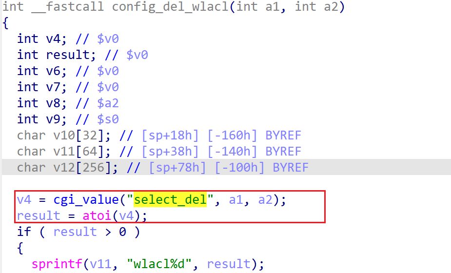

# wndrmacv2-1.0.0.4 DoS vulnerability
## firmware version
vendor: netgear

product: wndrmacv2

version: below or equal wndrmacv2-1.0.0.4

## description
In netgear wndrmacv2-1.0.0.4, binary `/usr/sbin/uhttpd` contains a NULL pointer dereference vulnerability in `config_del_wlacl`. Attackers can send malicious packet to trigger the vulnerability.

## Impact
Attackers can send malicious packet to trigger the vulnerability, causing Denial Of Service.

## detail
In function `config_del_wlacl` (address: 0x438D38), the following code parses user's input containing `select_del` into `v4`.

Then `v4` is used and dereferenced without checking whether it's NULL or not, causing potential NULL pointer dereference. 

## poc
see [poc](./poc)

see [backtrace](./backtrace) for more information.
