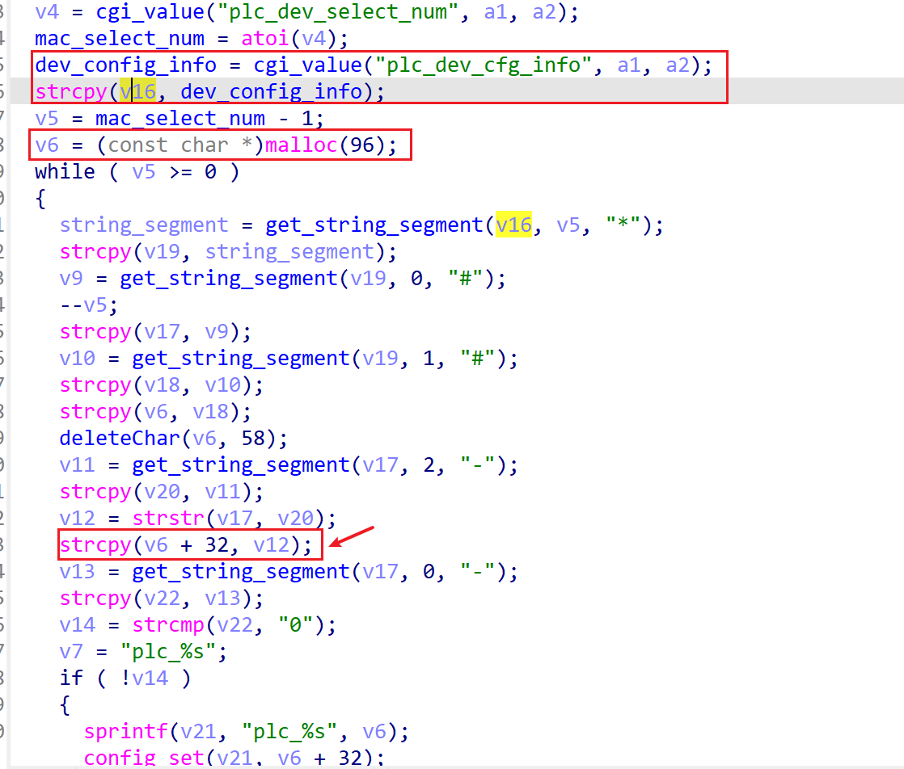

# wndrmacv2-1.0.0.4 heap buffer overflow vulnerability
## firmware version
vendor: netgear

product: wndrmacv2

version: below or equal wndrmacv2-1.0.0.4

## description
In netgear wndrmacv2-1.0.0.4, binary `/usr/sbin/uhttpd` contains a heap buffer overflow vulnerability in `config_plc_dev_config`. Attackers can send malicious packet to trigger the vulnerability.

## Impact
Attackers can send malicious packet to trigger the vulnerability, causing Denial Of Service or arbitary code execution.

## detail
In function `config_plc_dev_config` (address: 0x42F0E0), the following code parses user's input containing `plc_dev_cfg_info` into `dev_config_info`. Then malloced a fixed-length buffer(96 bytes) for storage

However, in the following code, the string in `dev_config_info` is the parsed with pattern('#' and '-') without length checking. In `strcpy` at 0x42F2C0, heap-based buffer will be overflowed by `strcpy` if an attacker provides a malicious input in `dev_config_info`. examples is "dev_config_info=1\*2#3#3-" + "3"\*0x100
