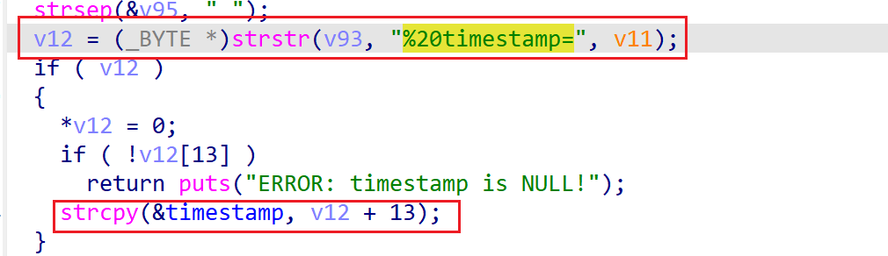

# wndrmacv2-1.0.0.4 global buffer overflow vulnerability
## firmware version
vendor: netgear

product: wndrmacv2

version: below or equal wndrmacv2-1.0.0.4

## description
In netgear wndrmacv2-1.0.0.4, binary `/usr/sbin/uhttpd` contains a global buffer overflow vulnerability in `config_plc_dev_config`. Attackers can send malicious packet to trigger the vulnerability.

## Impact
Attackers can send malicious packet to trigger the vulnerability, causing Denial Of Service or arbitary code execution.

## detail
In function `handle_request` (address: 0x40AFD4), the following code parses user's input containing `%20timestamp=`.

However, the result is used and copied into global variable `timestamp` without checking length, causing potential gl;obal buffer overflow. This can result in overwriting function pointer and cause arbitary code execution.

## poc
see [poc](./poc)

