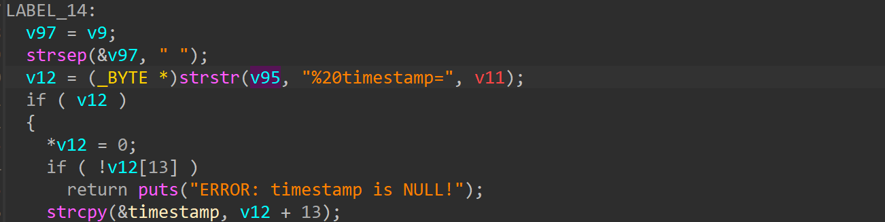
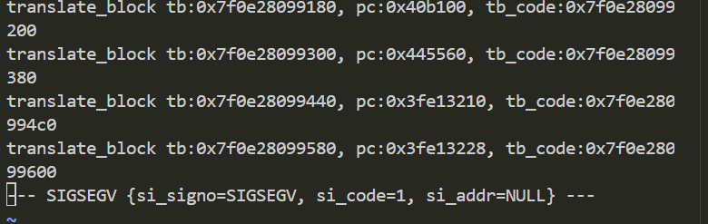

# wndrmacv2-1.0.0.4 DoS vulnerability
## firmware version
vendor: netgear

product: wndrmacv2

version: below or equal wndrmacv2-1.0.0.4

## description
In netgear wndrmacv2-1.0.0.4, binary `/usr/sbin/uhttpd` contains a NULL pointer dereference vulnerability in `strstr`. Attackers can send malicious packet to trigger the vulnerability, causing DOS on this firmware.

## detail
In function `handle_request` (address: 0x40AFD4), the following code contains NULL pointer dereference vulnerability. The parameter of `strstr` maybe NULL, causing DoS on this firmware

## send packet
You can send the POC packet via TCP to the `80` port of the firmware's web server to trigger the vulnerability.

## poc
see [poc](./poc)

## screenshot
The qemu logging shows that the web server encounters a crash and SEGSEGV signal has triggered, and web server has stoppod working.

