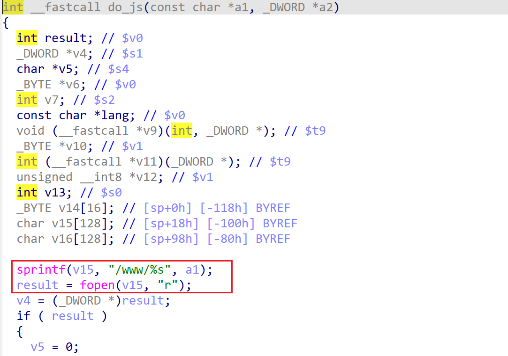

# wndrmacv2-1.0.0.4 stack-based buffer overflow vulnerability
## firmware version
vendor: netgear

product: wndrmacv2

version: below or equal wndrmacv2-1.0.0.4

## description
In netgear wndrmacv2-1.0.0.4, binary `/usr/sbin/uhttpd` contains a stack-based buffer overflow. The vulnerability lies in function `do_js`

## Impact
Attackers can send malicious packet to trigger the vulnerability, causing DOS or execute arbitary code on this firmware.

## detail
In function `do_js` (address: 0x408AA8), the following code contains stack-based buffer overflow vulnerability. Buffer `v15`'s length is fixed, which maybe overflowed by `sprintf`, which concats user's input into a stack-based buffer without checking its length.

## poc
see [poc](./poc)

see [backtrace](./backtrace) for more information

