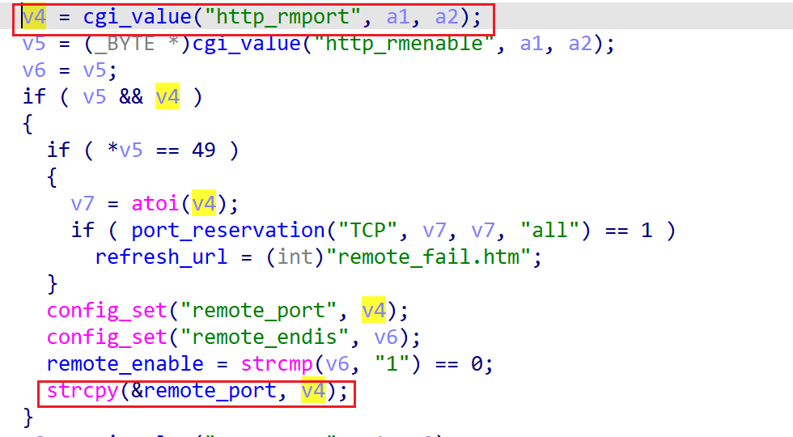

# wndrmacv2-1.0.0.4 global buffer overflow vulnerability
## firmware version
vendor: netgear

product: wndrmacv2

version: below or equal wndrmacv2-1.0.0.4

## description
In netgear wndrmacv2-1.0.0.4, binary `/usr/sbin/uhttpd` contains a global buffer overflow vulnerability in `config_remote`. Attackers can send malicious packet to trigger the vulnerability.

## Impact
Attackers can send malicious packet to trigger the vulnerability, causing Denial Of Service or even arbitary code execution.

## detail
In function `config_remote` (address: 0x43BB4C), the following code parses user's input containing `http_rmport` into `v4`. Then `v4` is concated into a global buffer `remote_port` without checking its length, causing potential global buffer overflow.

The overflow can overwrite global function pointer, causing arbitary code execution.
