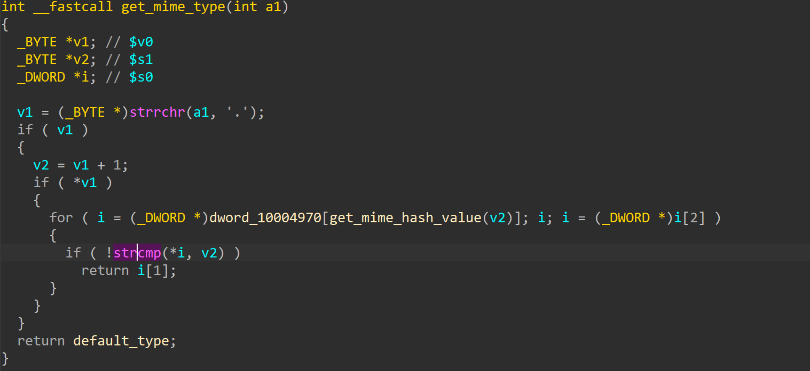
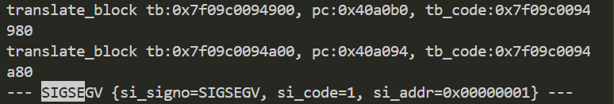

# wnr2000v1-1.1.3.9 DoS vulnerability
## firmware information
vendor: netgear

product: wnr2000v1

version: below or equal wnr2000v1-1.1.3.9

support url: https://www.netgear.com/support/product/wnr2000v1/#download

firmware download url: https://www.downloads.netgear.com/files/GDC/WNR2000v1/WNR2000%20Firmware%20Version%201.1.3.9%20(All%20regions%20except%20North%20America).zip

## description
In netgear wnr2000v1-1.1.3.9, binary `/bin/boa` contains a NULL pointer dereference vulnerability. Attackers can send malicious packet to trigger the vulnerability.

## detail
In function `get_mime_type` (address: 0x40A01C). If the parameter of strcmp is NULL, a NULL pointer dereference will happen and causes the web server to stop working.

## send packet
You can send the POC packet via TCP to the `80` port of the firmware's web server to trigger the vulnerability.

## POC
see [poc](./poc)

## screenshot
The qemu logging shows that the web server encounters a crash and SEGSEGV signal has triggered.

## timeline
[24/10/11] report to vendor and CVE