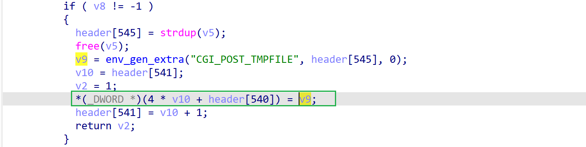

# wnr2000v1-1.1.3.9 DoS vulnerability
## firmware information
vendor: netgear

product: wnr2000v1

version: below or equal wnr2000v1-1.1.3.9

support url: https://www.netgear.com/support/product/wnr2000v1/#download

firmware download url: https://www.downloads.netgear.com/files/GDC/WNR2000v1/WNR2000%20Firmware%20Version%201.1.3.9%20(All%20regions%20except%20North%20America).zip

## description
In netgear wnr2000v1-1.1.3.9, binary `/bin/boa` contains a NULL pointer dereference vulnerability. Attackers can send malicious packet to trigger the vulnerability.

## detail
In function `process_header_end` (0x40d534) contains a NULL pointer dereference vulnerability. Dur to the complexity of binary reversing, I didn't figure the root cause. The dereference at 0x40D534 causes NULL pointer dereference and crashes the web server. 

In pseudo code, the following line contains NULL pointer dereference vulnerability
`*(_DWORD *)(4 * v10 + header[540]) = v9;`
## POC
see [poc](./poc)

you can refer to [backtrace](./backtrace) for further analysis
