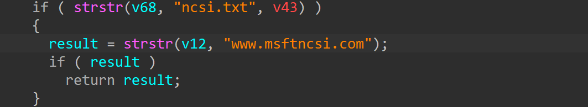
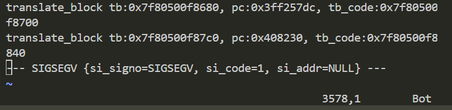

# wnr2500-1.0.0.24 DoS vulnerability
## firmware version
vendor: netgear

product: wnr2500

version: below or equal wnr2500-1.0.0.24

support url: https://www.netgear.com/support/product/wnr2500/

firmware download url: https://www.downloads.netgear.com/files/GDC/WNR2500/WNR2500-V1.0.0.24NA.zip

## description
In netgear wnr2500-1.0.0.24, binary `/usr/sbin/uhttpd` contains a NULL pointer dereference. Attackers can send malicious packet to trigger the vulnerability, causing DOS on this firmware.

## detail
In function `handle_request` (address: 0x407660), the following code contains NULL pointer dereference vulnerability. The parameter of `strstr` isn't checked, if it's `NULL`, the firmware will crash, causing DoS.

## send packet
You can send the POC packet via TCP to the `80` port of the firmware's web server to trigger the vulnerability.

## poc
see [poc](./poc)

## screenshot
The qemu logging shows that the web server encounters a crash and SEGSEGV signal has triggered, and web server has stoppod working.From the logging information, a NULL pointer dereference and DoS on firmware can be observed.

## timeline
[24/10/11] report to vendor and CVE
