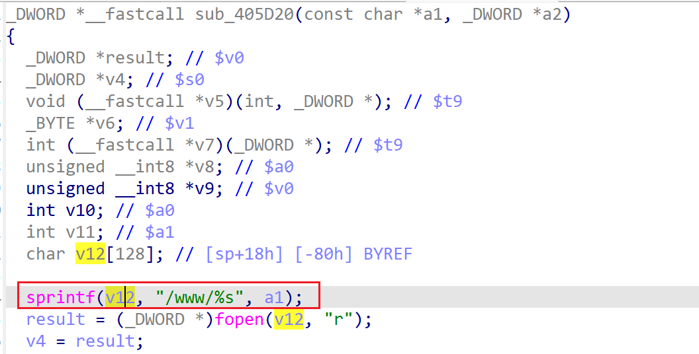

# wnr2500-1.0.0.24 stack-based buffer overflow vulnerability
## firmware version
vendor: netgear

product: wnr2500

version: below or equal wnr2500-1.0.0.24

support url: https://www.netgear.com/support/product/wnr2500/

firmware download url: https://www.downloads.netgear.com/files/GDC/WNR2500/WNR2500-V1.0.0.24NA.zip

## description
In netgear wnr2500-1.0.0.24, binary `/usr/sbin/uhttpd` contains a stack-based buffer overflow vulnerability. Attackers can send malicious packet to trigger the vulnerability. The vulnerability lies in function `sub_405D20`.

## Impact
The vulnerability can cause Denial Of Service of the device, or even arbitary code execution.

## detail
In function `sub_405D20` (address: 0x405D20), the following code concats user's input into local variable `v12`, which is a stack-based variable with limited size.

However, it didn't check the length of input from user, Causing potential stack-based buffer overflow. 

## poc
see [poc](./poc)

see [backtrace](./backtrace) for more information.