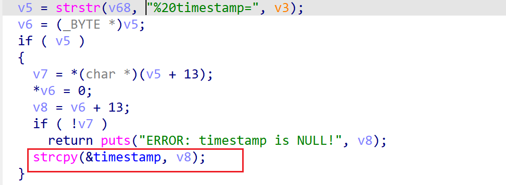

# wnr2500-1.0.0.24 global variable buffer overflow vulnerability
## firmware version
vendor: netgear

product: wnr2500

version: below or equal wnr2500-1.0.0.24

## description
In netgear wnr2500-1.0.0.24, binary `/usr/sbin/uhttpd` contains a global variable buffer overflow vulnerability. Attackers can send malicious packet to trigger the vulnerability. The vulnerability lies in function `handle_request`.

## Impact
The vulnerability can cause Denial Of Service of the device, or even arbitary code execution.

## detail
In function `handle_request` (address: 0x405D20), the following code concats user's input into global variable `timestamp`, which is a global variable with limited size.

However, it didn't check the length of input from user, Causing potential global variable buffer overflow. 

## poc
see [poc](./poc)
