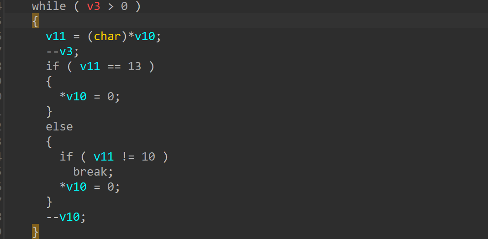
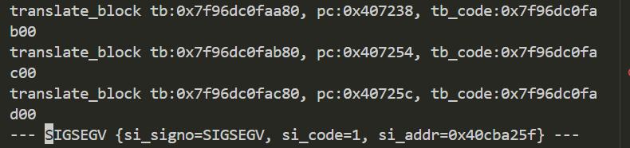

# xavn2001v2-0.4.0.7 out-of-bound write vulnerability
## firmware version
vendor: netgear

product: xavn2001v2

version: below or equal xavn2001v2-0.4.0.7

## description
In netgear xavn2001v2-0.4.0.7, binary `/usr/sbin/uhttpd` contains a out-of-bound write and DoS vulnerability. Attackers can send malicious packet to trigger the vulnerability.

## detail
In function `sub_407114` (address: 0x407114), the following loop doesn't check the boundry of the data, causing infinite loop , out-of-bound write and crash.

## send packet
You can send the POC packet via TCP to the `80` port of the firmware's web server to trigger the vulnerability.

## poc
see [poc](./poc)

## screenshot
The qemu logging shows that the web server encounters a crash and SEGSEGV signal has triggered, and web server has stopped working. The pc indicates that there exists an out-of-bound read.

## timeline
[24/10/11] report to vendor and CVE
