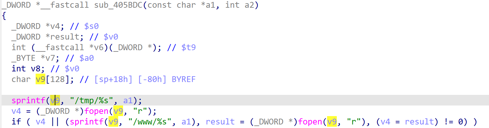

# xavn2001v2-0.4.0.7 stack-based buffer overflow vulnerability
## firmware version
vendor: netgear

product: xavn2001v2

version: below or equal xavn2001v2-0.4.0.7

## description
In netgear xavn2001v2-0.4.0.7, binary `/usr/sbin/uhttpd` contains a stack-based buffer overflow vulnerability. Attackers can send malicious packet to trigger the vulnerability. The problem lies in function `sub_405BDC`.

## Impact
The vulnerability can cause Denial Of Service of the device, or even arbitary code execution.

## detail
In function `sub_405BDC` (address: 0x405BDC), the following code concats user's input into local variable `v9`, which is a stack-based variable with limited size 256 bytes.

However, it didn't check whether length of input from user is below 256 bytes. Causing potential stack-based buffer overflow. 

## poc
see [poc](./poc)

see [backtrace](./backtrace) for more information.
